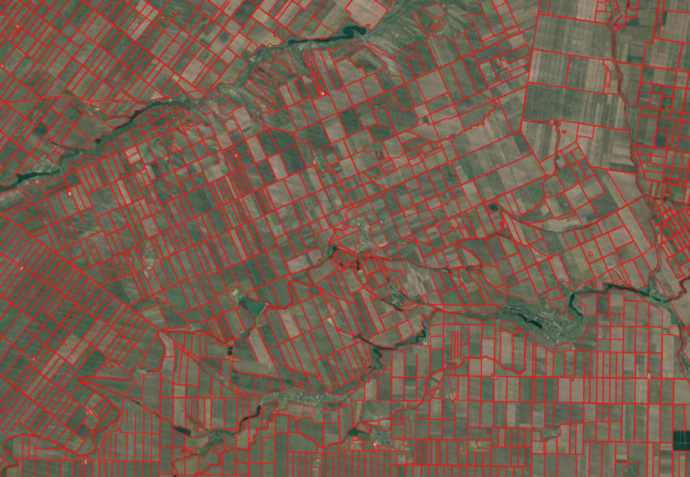

# Применение нейронных сетей для выделения геометрий с/х полей на примере Ставропольского края

## Введение
Проблема отсутствия актуальных геопростанственных данных в области сельского является является актуальной для исследователей и производителей. Наиболее распостраненным подходом к получению таких данных является ручная векторизация геометрий непосредственно из космических или аэрофотоснимков. На данный момент разработаны подходы и решения для получения геопространственных данных на основании данных дистанционного зондирования (ДЗЗ). Эти решения основаны на использовании отражательных свойств поверхнсоти в разных диапозонах электромагнитного спектра (ЭМС), однако классическое машинное обучение не позволяет учитывать геометрию объектов при проведении подобных работ. С этой задачей могут справится сверточные нейронные сети (CNN). Исследований связанных с применением глубокого обучения для задач сегментации объектов достаточно много, однако русскоязычных методик все еще мало. Данное исследование вдохновлено материалами опубликованными [В данном репозитории](https://github.com/chrieke/). Ключевыми отличиями моего исследования от представленного в репозитории является набор используемых каналов - в исследовании Christoph Reike используются данные в диапозонах Red, Green,  Blue, в нашей работе использовались диапазоны Red, Green, Blue, NIR (ближний инфракрасный диапозон). Кроме этого, интерес представляла полная реализация цикла получения геопространственных данных отражающих сельскохозяйственные объекты включающая

- Получение спутниковых данных

- Подготова полученных данных для  применения их в нейронной сети

- Сборка данных в единый массив геопространственных данных (получение контуров с/х объектов в итересующем регионе)

## Цель и задачи

*Целью исследования* является оценка возможности использования глубокого обучения для сегментации сельскохозяйственных полей на примере Ставропольского края. Для достижения данной цели был поставлен ряд задач:
1. Получение и подготовка данных для обучения нейронной сети 

    - Получение исходного масива растровых данных 
    - Нарезка этих данных в патчи (разбиение исходного массива в отдельные квадраты одинакогово размера и разрешения для того чтобы нейронная сеть могла с ними работать)
    - Паралельно возникла задача сохранения геопространственной привязки исходных патчей (нейронные сети не умеют работать с пространственными  данными)
2. Обучение модели
    - Выбор оптимальной архитетктуры нейронной сети для решения поставленной задачи 
    - Непосредственное обучение нейронной сети
    - Сохранение состояния нейронной сети для дальнейшего использования 
3. Практическое использование полученной неройнной сети
    - Разработка интерфейса для получения готовых векторных данных

## Получение и подготовка данных 

### Получение данных 

В качестве источника данных дистанционного зондирования использовался сервис [Google earth engine](https://earthengine.google.com/). Использовались данные [Sentinel - 2](https://sentinel.esa.int/web/sentinel/missions/sentinel-2). Код для получения данных представлен в [этом скрипте](scripts/get_raster_data.py). Класс SEN2_downloader представленный в скрипте выполняет следующую функцию: 

 - На вход принемается интересующая геометрия (рис. 1), год за который необходимо получить данные 
 - Скрипт получает геометрию за год, подбирает растровые данные имеющиеся в архиве GEE, проводит их очистку от облаков, снега, теней облаков итп. Из большого масива космических снимков строится медиальное изображение за год
 - Далее локально происходит скачивание растра в формате .tif (Рис.2) (в репозитории не представлены исходные растровые данные т.к. общий вес исходных данных составил 28.8 гб, приведем только скриншот одного из районов Став. края, тут и далее в изображения будет иллюстрироваться на примере Буденновского района края)
  

Рис.1 Районы Ставропольского края

 Процесс скачивания данных в цикле для всех районов Став. края отражен в блокноте [data_download.ipynb](data_download.ipynb)

 

Рис.2 Пример скачанных данных

Кроме исходных растровых данных для обучения нейронной сети было необходимо создать маску с/х полей на которых и производилось бы обучение. Изначально в наличии имелись данные оцифрованных полей - 15294 полигона (рис.3). Векторные данные были переведены в растровый формат

 

Рис.3 Пример векторных данных

 ### Нарезка данных в отдельные патчи (квадраты)

Первым этапом нарезки являлся подбор размера отдельно взятого квадрата. В Ставропольском крае с/х поля имеют достаточно большой размер. В [репозитории](https://github.com/chrieke/) на котором во многом основывался автор данного исследования, предлагалось использовать квадрат(патч) размером 128х128px. В нашем случае такие размеры использовать было невозможно, так как средний размер поля в Ставропольском крае значительно превышает размер поля в Дании ([Christoph Reike](http://chrieke.com/) приводит в своем исследовании Данию). Первой идеей было использовать патчи размером 400x400px, что при разрешении каналов RGB+NIR 10 метров дало бы на выход изображение 4х4км. Однако в дальнейшем уже при обучении данный размер оказался не оптимален (не хватало объема бесплатной GPU памяти предоставляемой google collab и kaggle для обсчета кадого отдельного патча, даже при уменьшении размера батча до 8). Так как имелись векторные данные покрывающие лишь небольшую часть данных необходимо было подготавливать патчи в которые входили бы только размеченные (оцифрованные) данные для этого: 

1. Необходимо было объеденить рядом лежащие оцифрованные полигоны в единый полигон- для этого вокруг каждого отдельного поля строился буфер в 250 метров, и пересекающиеся полигоны объединялись 
2. В результате объединения было полученно несколько больших полигонов внутри которых необходимо было создать сетку квадратов- создавалась сетка покрывающая всю обследуемую область, в нашем случае Весь Став. край. Для получения более точных данных и увеличения выборки сетка строилась в нахлест (квадраты находили друг на друга на 400 метров по всем плоскостям)
3. Внутри полученных после буферизации с/х геометрий отсекались целые не нарушенные квадраты
4. Данные квадраты (патчи) использовались для нарезания исходных данных дзз и данных маски 
5.  Процесс нарезки учебного датасета в цикле для каждого района Став. Края представлен в блокноте [data_preaparation.ipynb](data_preaparation.ipynb)
    - Данне (спутниковые данные и маска) для каждого конкретного района обрезаются по патчам расположенным внутри геометрии района
    - Метаданные включающие информацию о расположении патча и географических метаданных сохраняются в .json для дальнейшего использования

Процеес подготовки геометрий (буферизованных зон, сетки патчей для создания обучающего дата сета итп) осуществлялись в Q-gis
Подробно процесс отражен на Рис. 4

  
Рис.4 Процесс получения данных для н нарезки масок и спутниковых снимков

## Обучение модели 
### Общее о модели
В качестве архитектуры нейронной сети была выбрана U-net  с колличеством input - 4x256x256 - так как каждый патч имеет 4 канарала и размер 256 на 256 пикселей. Loss функция использовалась [BCEWithLogitsLoss](https://pytorch.org/docs/stable/generated/torch.nn.BCEWithLogitsLoss.html), точность оценивалась при помощи [IoU](https://medium.com/analytics-vidhya/iou-intersection-over-union-705a39e7acef).
Нейронная сеть обучалась на ресурсах kaggle, так как у автора отсутствует необходимые мощности GPU (в дальнейшем сеть работала локально на gpu GeForce 1050 mobile 4gb). Ноутбук с процессом обучения - [sentinel-segmentation_UNET.ipynb](sentinel-segmentation_UNET.ipynb)
Ноутбук. Пример данных на рис.5

  
Рис.5 Полученный в результате обработки учебный датасет - сверху исходные изображения, снизу маски с/х полей

Выбор U-net обусловлен наиболее частой встречаемостью данной архитектуры для работы с данными ДЗЗ

### Результаты обучения 

Обучение сети показало достаточно высокую степень качества (итоговый скор около 98%)

  
Рис.6 Точность сети UNet

  
Рис.7 Лосс сети UNet

Результаты обучения представлены на Рис.8 - сверху исходное изображение, по середине маска по которой сетка училась, внизу результат работы сети. Тут важно сказать что было необходимо выбрать точку отсечения классов (какая веротность). В рамках данного исследования я разделял данные на уровне >0.62.  Это чисто экспертная оценка основанная на визуальном качестве определения полей. В целом можно автоматизировать этот процесс в дальнейшем и подобрать наиболее оптимальный параметр
  
  
Рис.8 Полученный в результате обработки учебный датасет - сверху исходные изображения снизу маски с/х полей

## Получение геометрий с/х полей из растрового изображения Sentinel-2

Итоговой частью работы был сбор воедино скриптов связанных с  обработкой, работе обученного UNet и итоговой сборке векторного изображения с/х полей интересующего региона. 

В ноутбуке [project.ipynb](project.ipynb) подробно описан процесс работы всех скриптов и инструментов, здесь я ограничусь тезисным описанием процесса работы и тем что у нас есть до и после:

1. На старте у пользователя есть только геометрия отражающая интересующий его регион (далее по тексту стартовая геометрия), в нашем случае это просто раедомный    [прямоугольник](data/geoms/example_geometry_WGS84.geojson) (в моем случае этот прямоугольник уже в метрической проекции ЮТМ 38 зона N)
2. Из системы GEE (Google earth engine) происходит выгрузка интересующего нас спутникового снимка за интересующий нас год в пределах стартовой геометрии
3. В пределах стартовой геометрии строим решетку из квадратов 2560х2560 м (у нас метрическая проекция а расрешение полученного изображени 10м)
4. Далее полученный в шаге 2 растр режется на патчи а метаданные о патчах сохраняются в [patches_meta.json](/data/temp/patches_meta.json)
5. Готовые патчи поочередно загружатся в модель, после получения резульатат выходному из сети изображению присваиваются данные из [patches_meta.json](/data/temp/patches_meta.json). Сеть работала на локальной GPU автора исследования
6. Происходит сборка (merge) общей растровой маски в педелах стартового полигона, и дальнейшая его векторизация
7. На выход подается готовое векторное представление геометрий с/х полей в пределах стартового полигона 

На рис. 9 представлена уже готовая карта (чтобы отразить что данные имеют географическую привязку) основанная на результатах

 

Рис.9  Карта -построенная на основании результатов полученных от UNet

На данный момент результат не иделен. В качестве с/х полей модель иногда воспринимает массивы леса и другие стороние объекты. 

Какие причины этого есть:

1. Исходный датасет на котором обучалась модель был далек от идела, цифровокой полей на протяжении долгого времени занимались разные люди.
2. В нашей модели использовались данные 5 агроклиматических зон котоыре имеют совершенно разнные размеры и геометрии полей, где то есть поля орошения (часть из них модель довольно неплохо распознает что было определено на других примерах). Возможно нужно обучать на каждую агроклиматическую зону свою сетку 
3. Возмоно хорошим подходом для решения этой проблемы будет применение мультиклассовой сегментации, с внесением еще ряда классов кроме бинарных 0 - не с/х поле 1- с/х поле - условно лесной массив, водная поверхность, с/х поле итп. 

## Выводы 

1. Цели и задачи конкретного исследования технические реализованы, проект готов для практического использования. 
2. Нейронная сеть Unet  с высокой степенью качества спраляется с задачей сегментации с/х полей на нашем примере 
3. Над чем следует работать: 
    - Имеет смысл обернуть имеющийся код в docker для простоты его использования другими пользователями
    - Сеть стоит в будущем обучать не бинарном датасете, имеет смысл использовать многоклассовую сегментацию 
